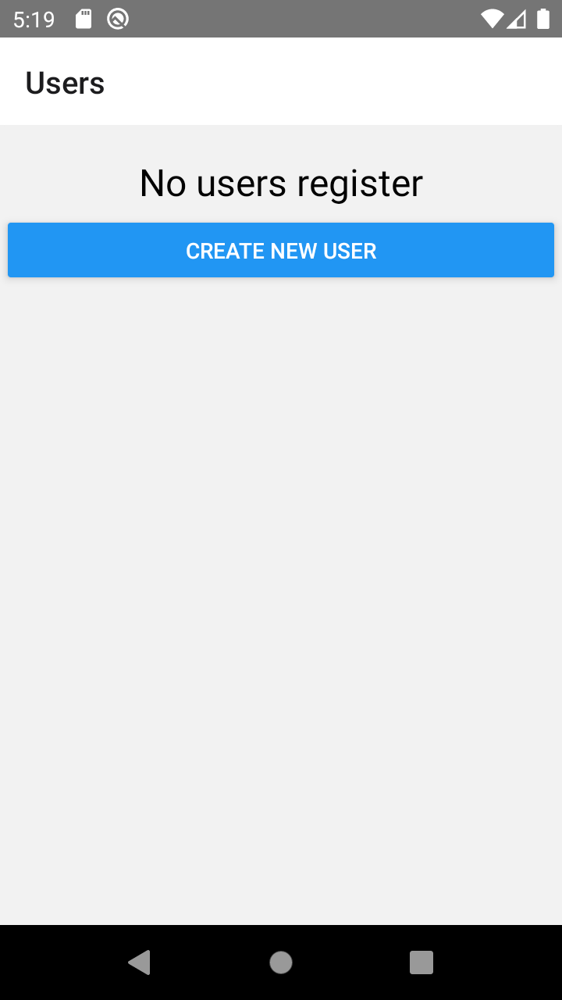
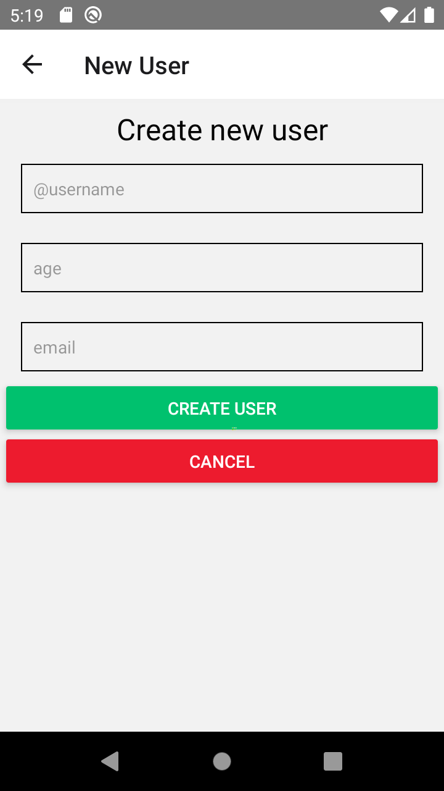

## created with react native cli
### react native CRUD

url .env file. JSON_SERVE_DEVELOPMENT = 'http://172.17.240.1:4000/users'
change ip for you ip:
1.- open cmd
2.- ipconfig
3.- copy your ip http://{yourIP}:4000/users

## Run project:

npx react-native-android

## to run json facke serve:

json-server --host {your IP} --watch db.json -p 4000 ->you can chage port your preference

